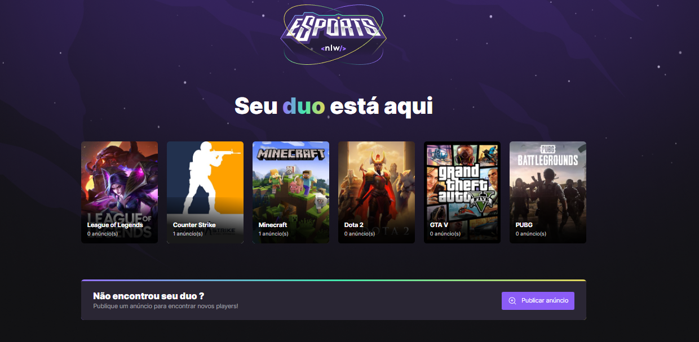
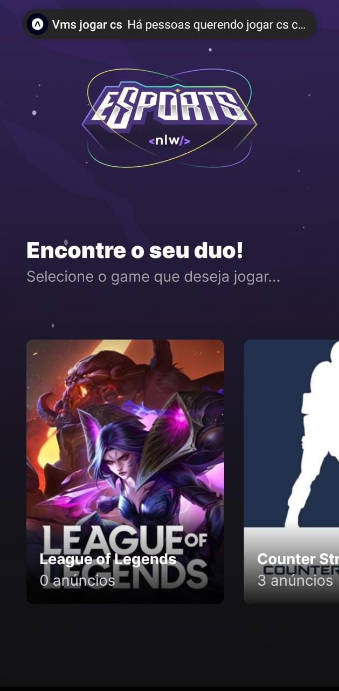

<h1 align="center">
  
</h1>

<br></br>

<p align="center">
  <a href="#-Technologies"><b>Technologies</b></a>&nbsp;&nbsp;&nbsp;|&nbsp;&nbsp;&nbsp;
  <a href="#-Project"><b>Project</b></a>&nbsp;&nbsp;&nbsp;|&nbsp;&nbsp;&nbsp;
  <a href="#-Layout"><b>Layout</b></a>&nbsp;&nbsp;&nbsp;
</p>

<br>

<h1 align="center" flexDirection="row">
  
  
</h1>

## 🚀 Getting started

Clone the project and access the folder.

### Web

```bash
$ https://github.com/diaspd/find-your-duo.git
$ cd web

# Install the dependencies
$ npm install

# Make a copy of '.env.local.example' to '.env.local'
$ cp .env.local.example .env.local

# Start the application
$ npm run dev

```
### Server

```bash
$ cd server

# Install the dependencies
$ npm install

# Make a copy of '.env.example' to '.env'
# and set with YOUR environment variables.
$ cp .env.example .env

$ npx prisma migrate dev

# Start the server
$ npm run dev

```
### Mobile

```bash
$ cd mobile

# Install the dependencies
$ npm install

# for android
$ npm run android

# for ios
$ npm run ios

# start the bundle
$ npm run start
```


<br></br>

## 💻 Technologies

This project was developed with the following technologies:

- React
- TailwindCss
- TypeScript
- React Native
- Expo
- Vitejs
- Express
- prisma


## 📄 Project
💰 Project made for gamers find they'r duo on games.

<br></br>

## 🔖 Layout
- [NLW eSports - Figma](https://www.figma.com/community/file/1150897317533332617)


<br></br>

Made with ♥ by Pedro Dias. 👋 Follow me on social media! <br></br>

If you can give a little star, I appreciate it 🤩
